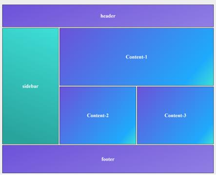

# zeus-training

## task-1
Day 1 Run through the HTML CSS crash course - we will use Zoom sessions -  

- Setup VS Code for HTML5, CSS, JS development 
https://www.youtube.com/watch?v=xn7-Wx1tD_4  
- https://www.youtube.com/watch?v=qz0aGYrrlhU  - 1 hr 
- https://scrimba.com/learn/htmlcss  - 4hr 
- Introduction to organising CSS  
https://medium.com/wolox/8-tips-to-keep-css-organized-1c7e0bcaa905 
- CSS - font property have a closer look at it  
https://www.w3schools.com/cssref/pr_font_font.asp 
https://www.w3schools.com/cssref/pr_font_font-style.asp 
https://www.w3schools.com/cssref/pr_font_font-variant.asp 
https://www.w3schools.com/cssref/pr_font_weight.asp  
Introduction to Webfont - https://www.youtube.com/watch?v=G0cOQ79WKZE 

## task-2

- Create the following page using the details given in the following document IL 
- Code Review Guildelines and Strategy.docx
IL - Code Review Guildelines and Strategy.docx
- https://docs.github.com/en/github/getting-started-with-github/quickstart/create-a-repo on GitHub 
- Learn CSS Grid https://scrimba.com/learn/cssgrid 
- Learn FlexBox	https://scrimba.com/learn/flexbox 
- Introduction to https://scrimba.com/learn/bootstrap4  
 
- create the following page using a CSS grid  
 

## task-3
- Develop Quantum Login page (Quantum login page)
- Develop a Quantum Dashboard page  
Header 
footer 
Navbar 
Sidebar 
Main content page 
- Specification https://xd.adobe.com/view/c8dc4fb8-01ae-4826-9a50-e8a05bc2a8e7-9d8f/
- Assets: quantum screen assets
 
- Agile course - http://growingagile.thinkific.com/courses/scrumbasics
- How browsers work - https://www.html5rocks.com/en/tutorials/internals/howbrowserswork/